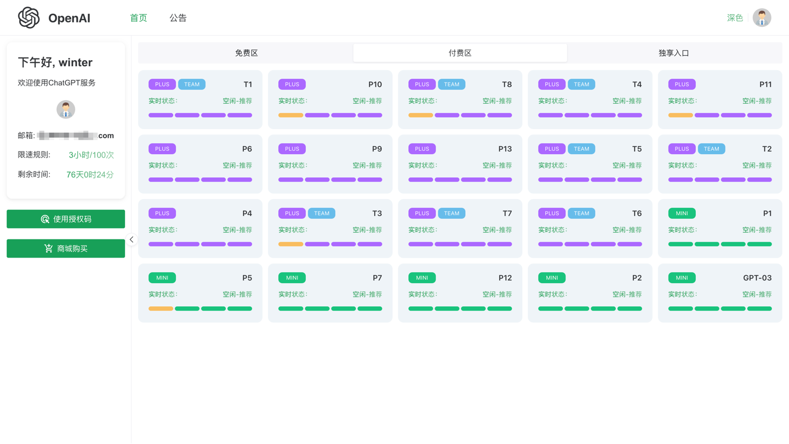

# chatgpt-share-server

## 源码来自`xyhelper`

## 此项目完全兼容原版share，即使增加了用户体系，放心安装【二开自行辨别!!!】

## 在线体验
- 用户端：[demoe.ainx.cc](https://demoe.ainx.cc) 【自行注册账号】
- 管理端：[demoe.ainx.cc/xyhelper](https://demoe.ainx.cc/xyhelper) 

## 日志
- 2024/03/18 修复UserToken过期了还能使用的问题
- 2024/03/21 用户管理模块增加UserToken的模糊查询
- 2024/04/15 增加第三方支付回调事件
- 2024/04/16 增加批量创建userToken功能
- 2024/04/30 增加用户体系全套功能 登录、注册、忘记密码、授权码兑换...

## 系统截图说明
### 用户界面
- [x] 用户登录
- 
- [x] 用户注册
- 
- [x] 忘记密码
- 
- [x] 用户主页面【黑色】
- 
- [x] 用户主页面【白色】
- 
- [x] 授权码页面
- 
- [x] 商城购买页面
- 

### 后台页面
- [x] 客户管理页面
- 
- [x] 客户新增页面
- 
- [x] 账号新增页面
- 
- [x] 授权码新增页面
- 


## 如何部署

### 1、一键部署
```bash
curl -sSfL https://raw.githubusercontent.com/frontend-winter/chatgpt-share-server/master/quick-install.sh | bash
```

### 2、手动部署

- git clone https://github.com/frontend-winter/chatgpt-share-server.git
- cd chatgpt-share-server
- ./deploy.sh

### 3、老用户部署：如果你是老系统想直接迁移，请继续阅读
1、先备份，万事开头先备份，接着看
- 找到你的docker-compose.yml修改以下几个地方
```html
把这个地方注释掉：
#image: xyhelper/chatgpt-share-server:latest
加上这一行：
image: fewinter/chatgpt-share-server-prod:latest

如果你有自定义list页面，还要注释下面这一行
# - ./list:/app/resource/public/list

把这个地方注释掉【一共有三个地方需要修改，自行判断】
# - "com.centurylinklabs.watchtower.scope=xyhelper-chatgpt-share-server"
加上这一行
- "com.centurylinklabs.watchtower.scope=fewinter-chatgpt-share-server-prod"
```
- 保存 ./deploy.sh 不出意外的话应该能访问了

### 4、后台增加客户管理页面
- 点击系统管理 - 权限管理 - 菜单管理 - 增加列表【点击新增按钮】
- 填写以下参数，我这里已经填写好了
- 
- 新增权限
- 

### 遇到问题？请联系wx： `frontend-winter`

### 微信群
- 
## 此项目源码暂不开源，如有需要联系wx `frontend-winter`，可以获得15天体验日期

# 特别说明

本项目仅供学习和研究使用，我们不对任何因使用本项目而导致的任何损失负责。
