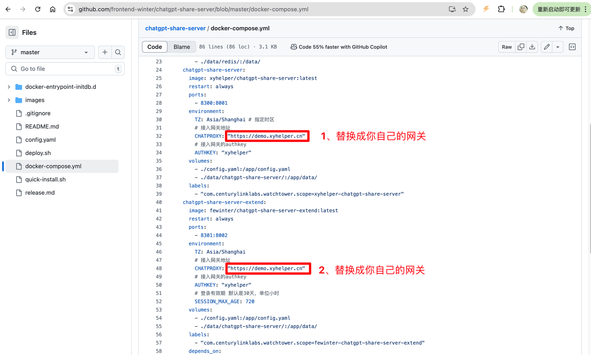
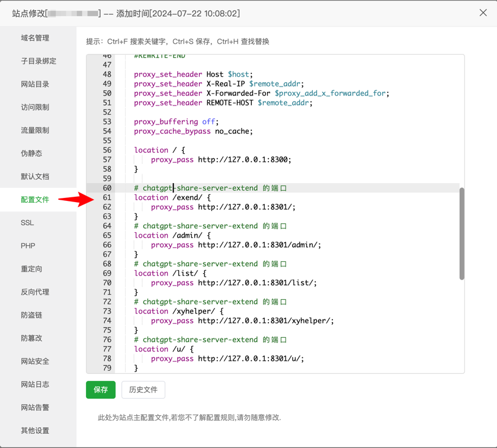

# chatgpt-share-server-extend

# 此项目是go语言开发的外挂容器版本`chatgpt-share-server-extend`，基于`chatgpt-share-server`项目，增加了用户注册、登录、授权码管理、商城购买等功能。

## xyhelper 原版项目地址 [chatgpt-share-server](https://github.com/xyhelper/chatgpt-share-server.git )

## 在线体验
- 用户端：[demo.ainx.cc](https://demo.ainx.cc) 【自行注册账号/体验账号:test@gmail.com:test@gmail.com】
- 管理端：[demo.ainx.cc/xyhelper](https://demo.ainx.cc/xyhelper) 


## 系统截图说明
### 用户界面
- [x] 用户主页面【黑色】
- 
- [x] 用户主页面【白色】
- 
- [x] 用户登录
- 
- [x] 用户注册
- 
- [x] 忘记密码
- 
- [x] 授权码页面
- 
- [x] 商城购买页面
- 

### 后台页面
- [x] 客户管理页面
- 
- [x] 客户新增页面
- 
- [x] 账号新增页面
- 
- [x] 授权码新增页面
- 


## 部署

### 1、部署教程

- 克隆项目：git clone https://github.com/frontend-winter/chatgpt-share-server.git
- 进入到文件夹：cd chatgpt-share-server
- 修改配置文件：docker-compose.yml
- 
- 启动项目：./deploy.sh

- nginx 配置文件 找到你的nginx配置，修改成以下配置。 
```nginx configuration
        proxy_set_header Host $host;
        proxy_set_header X-Real-IP $remote_addr;
        proxy_set_header X-Forwarded-For $proxy_add_x_forwarded_for;
        proxy_set_header REMOTE-HOST $remote_addr;
        
        proxy_buffering off;
        proxy_cache_bypass no_cache;
        
        # chatgpt-share-server 的端口
        location / {
            proxy_pass http://127.0.0.1:8300;
        }
        
        # chatgpt-share-server-extend 的端口
        location /exend/ {
            proxy_pass http://127.0.0.1:8301/;
        }
        # chatgpt-share-server-extend 的端口
        location /admin/ {
            proxy_pass http://127.0.0.1:8301/admin/;
        }
        # chatgpt-share-server-extend 的端口
        location /list/ {
            proxy_pass http://127.0.0.1:8301/list/;
        }
        # chatgpt-share-server-extend 的端口
        location /xyhelper/ {
            proxy_pass http://127.0.0.1:8301/xyhelper/;
        }
        # chatgpt-share-server-extend 的端口
        location /u/ {
            proxy_pass http://127.0.0.1:8301/u/;
        }
        # chatgpt-share-server-extend 的端口
        location = /list.js {
            proxy_pass http://127.0.0.1:8301/list.js;
        }

```

- 备用配置（如果上面配置不生效 使用备用配置）
```nginx configuration
        proxy_set_header Host $host;
        proxy_set_header X-Real-IP $remote_addr;
        proxy_set_header X-Forwarded-For $proxy_add_x_forwarded_for;
        proxy_set_header REMOTE-HOST $remote_addr;
        
        proxy_buffering off;
        proxy_cache_bypass no_cache;
        
        # chatgpt-share-server 的端口
        location / {
            proxy_pass http://127.0.0.1:8300;
        }
        
        # chatgpt-share-server-extend 的端口
        location /exend/ {
            proxy_pass http://127.0.0.1:8301/;
        }
        # chatgpt-share-server-extend 的端口
        location /admin/ {
            proxy_pass http://127.0.0.1:8301/admin/;
        }
        
        # chatgpt-share-server-extend 的端口
        location ~ ^/(list|xyhelper|u)(/.*)?$ {
            proxy_pass http://127.0.0.1:8301/$1$2;
        }
        
        # chatgpt-share-server-extend 的端口
        location = /list.js {
            proxy_pass http://127.0.0.1:8301/list.js;
        }


```

- 正确的配置看起来的是这样的
- 
- 把这些无用的配置注释
- 


### 2、xyhelper原版部署，请继续阅读
1、先备份、先备份、先备份 
- `docker compose down`
- `cp -r ../chatgpt-share-server ../chatgpt-share-server-bak`

2、备份好了？ 接着看
- 找到你的`docker-compose.yml`文件 在 `chatgpt-share-server` 下方再增加一个容器配置
```shell
  chatgpt-share-server-extend:
    image: fewinter/chatgpt-share-server-extend:latest
    restart: always
    ports:
      - 8301:8002
    environment:
      TZ: Asia/Shanghai
      # 接入网关地址
      CHATPROXY: "https://demo.xyhelper.cn" #替换成你的网关地址
      # 接入网关的authkey
      AUTHKEY: "xyhelper"
    volumes:
      - ./config.yaml:/app/config.yaml
      - ./data/chatgpt-share-server/:/app/data/
    labels:
      - "com.centurylinklabs.watchtower.scope=fewinter-chatgpt-share-server-extend"
```
- 保存 ./deploy.sh 
- 修改你的 nginx配置 如上

### 3、后台增加客户管理页面（2024/09/09 起 会自动生成菜单不需要再进行配置）
- 点击系统管理 - 权限管理 - 菜单管理 - 增加列表【点击新增按钮】
- 填写以下参数，我这里已经填写好了（如果你的文件路径没有client选项，说明nginx配置配置错误了）
- 
- 新增权限
- 
- 用户管理修改名称为授权码管理
- 

### 4、遇到这种情况的联系我开通一下域名 wx： `frontend-winter`(备注：share过白名单：【你的域名】，不然不会通过)
- 

### 遇到问题？重启服务
- `docker compose down`
- `./deploy.sh`
### 还是遇到问题？基本上你遇到的百分之90的问题文档都有写，请最少查看文档三遍以上。 
### 还是遇到问题？可以添加微信`frontend-winter`付费安装（备注：安装share，不然不会通过）

### 加微信群
- 

# 特别说明

本项目仅供学习和研究使用，我们不对任何因使用本项目而导致的任何损失负责。
